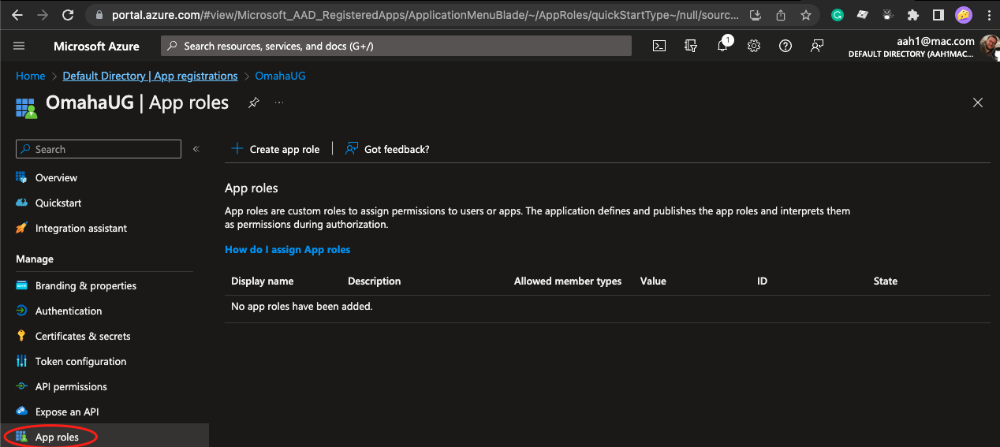
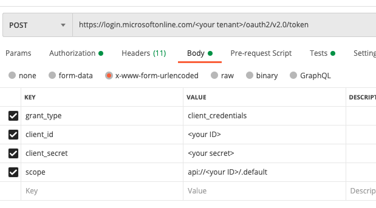

## Creating Custom RBAC Roles With .Net and Azure
This talk was created for the [Omaha .Net](https://omahamtg.com) as a lightening talk so the content will be light and hopefully easy to follow. If you'd like to continue on or have further questions feel free to open a pull request or Github issue respectively. 

## Requirements To Get Started
- [DotNet](https://dotnet.microsoft.com/en-us)
- [Azure CLI](https://learn.microsoft.com/en-us/cli/azure/install-azure-cli)
- [Azure Account](https://portal.azure.com)
- [Post Man]()

## Create App Registration In Azure
We want to being by going our to Azure specifically Azure AD and setting up a new app registration. In order to do that we want to go to https://www.portal.azure.com, sign in, and go to Azure Active Directory. Next, we want to click on app registrations in the side pane and then create a new test app registration. We will use single tenant for this example and redirect URI should be set to web and the redirect URI to https://oauth.pstmn.io/v1/callback. Now we land on the page with our client ID we are going to want to save that for later so copy and paste that into a note pad. On the same page there will also be our tenant ID we want to save that off too. After that we want to select expose our api and allow the default to be created.

##### Creating our Role
Now we are going to go to app roles. If you are in preview like me you can see an app role option in the blade like this 

if you don't have that you can add a role to the Manifest directly. To do that you want to find the empty appRoles array and add something like this to it
``` JSON
{
    "allowedMemberTypes": [
        "Application"
    ],
    "description": "OmahaUGAdmin",
    "displayName": "OmahaUGAdmin",
    "id": "0d72bf4f-6e5a-4dc0-979a-3bffe399677f",
    "isEnabled": true,
    "value": "OmahaUGAdmin"
}
```  
you also want to change "groupmembershipclaims" to this
```JSON 
"groupMembershipClaims": "SecurityGroup",
```
For this example we will be showing that the application level roles work (For example anything that can auth with this app registration will get this role). You can also add user roles instead of app if you are using roles assigned to people (which is the normal way you would use roles). Now finally to get tokens we can test with we are going to create a secret to use later so go to certificates and secrets, create one, and add the value to our running notepad! 

We also want to ensure we go to API permissions then add new my api's and find the role we just created as well as granting admin concent for it.

## Setup .Net Project
We want to create a web API to put authentication on so that will be done with this CLI command
``` bash
mkdir api
cd api
dotnet new webapi
```
That will create a folder for our api, change into that directory, and then create the api project.
We can then run our simple project with 
``` bash
dotnet add package Swashbuckle.AspNetCore
dotnet add package Microsoft.Identity.Web.UI
dotnet add package Microsoft.Identity.Web
dotnet add package Microsoft.AspNetCore.Authentication.JwtBearer
dotnet run
```
that will give us a swagger doc at https://localhost:5000/swagger/index.html to hit our unprotected API. 

Now we have a working unauthenticated endpoint we want to lock down our api. We can do that by adding 
``` cs
[Authorize(Policy = "OmahaUGAdminPolicy")]
```
to our weather controller and then we need to change Program.cs
``` cs
using Microsoft.AspNetCore.Authentication;
using Microsoft.AspNetCore.Authentication.JwtBearer;
using Microsoft.Identity.Web;
using Microsoft.IdentityModel.Logging;
```
we need to add these using statements at the top and then these next few lines under create builder
``` cs
builder.Services.AddAuthentication(JwtBearerDefaults.AuthenticationScheme)
    .AddMicrosoftIdentityWebApi(builder.Configuration.GetSection("AzureAd"));

builder.Services.AddAuthorization(options =>
{
    options.AddPolicy("OmahaUGAdminPolicy",
         policy => policy.RequireRole("OmahaUGAdmin"));
});
IdentityModelEventSource.ShowPII = true;
```
show PII is only a short term thing it'll give you hints on why you are getting 401s. Assuming everything is setup okay we now need to get an API token to test out in postman!
## Get a token
In order to get a token you are going to want to setup your postman to be similar to this photo
. With the response token you get back you want to copy that, create a new get request to https://localhost:5000/WeatherForecast and add bearer token authorization and paste that token in! Boom you are now using custom roles to authenticate against your API in .Net 6!